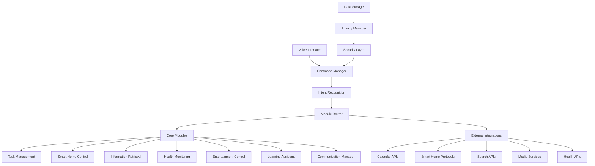

# Design Document

## Overview

The enhanced Jarvis system will be transformed from its current basic implementation into a comprehensive, ethical AI assistant. The design focuses on modularity, security, and extensibility while removing all illegal/unethical functionality. The system will maintain the existing voice-activated interface but expand capabilities across productivity, smart home control, health monitoring, and entertainment.

## Architecture

### High-Level Architecture



### Core Architecture Principles

1. **Modular Design**: Each feature area is implemented as a separate module with clear interfaces
2. **Security First**: All data processing includes encryption and privacy protection
3. **Extensible Framework**: New modules can be easily added without modifying core systems
4. **Local Processing**: Prioritize local processing with optional cloud integration
5. **Ethical Constraints**: Built-in safeguards prevent illegal or unethical operations

## Components and Interfaces

### 1. Enhanced Voice Interface Layer

**Purpose**: Improved speech recognition and natural language processing

**Components**:
- `EnhancedVoiceProcessor`: Upgraded from current `JarvisVoice` with noise filtering
- `NaturalLanguageProcessor`: Context-aware command interpretation
- `WakeWordDetector`: Multi-user wake word detection with speaker identification
- `VoiceResponseGenerator`: Text-to-speech with personality and emotion

**Key Interfaces**:
```python
class VoiceInterface:
    def listen_for_wake_word(self) -> bool
    def capture_command(self, timeout: int = 10) -> str
    def process_natural_language(self, text: str) -> Intent
  nd trackingification, ation, mod creaaskCal)
- T ik,tloo, Ougle Calendar(Gooegration  intar*:
- Calendties**Capabilile

*gement ModunaMaty oductivik and PrTas

### 1. ificationsodule Spec## Mconsent

r  use backup withncryptedync**: El Cloud S**Optionan
- n informatioessio ssed data anduently acces*: Freqemory Cache*a
- **In-Me dativ and sensitionatonfigurles**: Cpted JSON Fi*Encryerences
- * prefks,asata, t deror usage fmary stor**: Priatabasel SQLite D **Locaegy

-e Stratorag
### Data St`
e: dict
``current_stat[str]
    ies: listapabilit  col: str
   protoc
   pe: str tyme: str
       naid: str
 device_Device:
   class Smart
dataclass

@]s: list[str   tagtr
 tatus: se
    sdatetimte: ue_da int
    dity:iorstr
    prription: descstr
     title: r
   st
    id: ask:ass Ttaclass
clct

@das: diermission_pice  dev dict
  y_settings:   privacry: list
 g_histoearnin  ls: dict
  renceprefed: str
    ser_i    ue:
UserProfilss taclass
clat

@da: dicpdatestext_u   con: bool
 p_required   follow_uict
 data: d str
    message:ol
    s: bo  successe:
  duleResponss Moss
clataclastr

@daid: 
    user_: datetimetimestamp
    ntext: dict   co
 oatce: flnfiden    coies: dict
    entittion: str
t:
    ac
class Intensataclasn
@d
```pythouctures
trCore Data Sls

### ta Mode

## Daone
```-> Nstr) ata_type:  d: str,odulecess(self, mdit_data_ac
    def auanyytes) -> data: bncrypted_ata(self, eypt_def decr   dtes
  any) -> byta:dadata(self, ncrypt_ef e    d-> bool
)  Intentelf, intent:nce(siaical_complethvalidate_def     r:
curityLaye Seass
cl`python**:
``erfaces*Key Inthreats

* security teventsnd pr Detects aitor`:tyMon
- `Securitentionreon and ollectitrols data c: ConcyManager`vaata
- `Pritored d all s: Encryptsption`aEncry
- `Dattionshical opera/unetts illegaltor`: PrevenEthicsValidats**:
- `Componen
**ompliant
cy-crivand psecure ae  arl operationsre alsuose**: En*Purpy Layer

*rivacand P Security `

### 4.
``t) -> booltentent: In inself,est(idate_requalf v]
    det[strf) -> lisies(selbilit get_capa  defesponse
  > ModuleRict) -xt: dntent, contetent: Ite(self, in   def execu) -> bool
 tentent: Inle(self, intef can_hand    dseModule:
s Ba
clas``pythonrface**:
` Intele**Base Modu modules

 functionalce for allfazed interrditandapose**: S
**Puramework
le Fr Core Modu
### 3.`

``eResponse) -> Modulent: Intent intnd(self,comma route_    def
t) -> Nonetenintent: Inself, ontext(_c maintain def dict
    str) ->self, text:entities(ef extract_  d
  > Intent: dict) -textconxt: str, t(self, tessify_inten  def cla
  ognition:tRecclass Intenpython
**:
```y Interfacesons

**Keinteractimulti-step ages : Manoordinator``ResponseC
- ulesmodpriate ds to apprommanRoutes coandRouter`: xt
- `Commte conions conversatinaintaManager`: Montext
- `Cecognitionsed intent rier`: ML-baClassif- `Intentents**:
onompes

**Codulpropriate mte to apt and roud user intentaners: UndPurpose**gement

**anammand M and Cognitiont Reco2. Inten

### ``> str
`y) -: np.ndarraudioelf, aspeaker(sidentify_    def e
) -> Nonral""neut: str = r, emotiontext: ste(self, k_respons  def spea