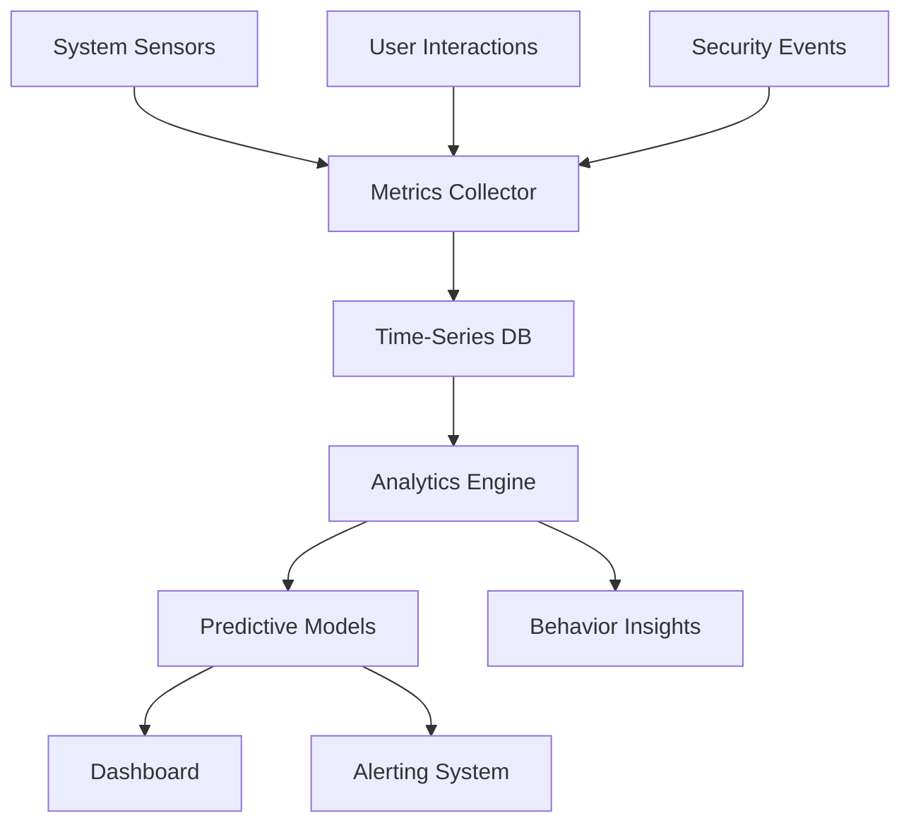

# 📊 Supreme Jarvis Monitoring & Analytics Enhancement Plan

## 🔍 Objectives
1. Real-time system health monitoring
2. Predictive analytics for proactive maintenance
3. User behavior analysis for personalization
4. Comprehensive performance insights
5. Automated anomaly detection

## ⚙️ Core Components

### 1. Unified Monitoring Framework
```python
# core/monitoring/unified_monitor.py
class UnifiedMonitor:
    def __init__(self):
        self.sensors = {
            'system': SystemSensor(),
            'performance': PerformanceSensor(),
            'security': SecuritySensor(),
            'user': UserBehaviorSensor()
        }
    
    def collect_metrics(self):
        return {name: sensor.capture() for name, sensor in self.sensors.items()}
    
    def detect_anomalies(self, metrics):
        # Use ML-based anomaly detection
        return AnomalyDetector().predict(metrics)
```

### 2. Predictive Analytics Engine
- Enhance `core/supreme/engines/analytics_engine.py`:
  ```python
  class EnhancedAnalyticsEngine:
      def predict_system_health(self, metrics):
          # Time-series forecasting
          forecast = self.time_series_model.predict(metrics['system'])
          
          # Failure prediction
          failure_risk = self.failure_model.predict(metrics)
          
          return {
              'forecast': forecast,
              'failure_risk': failure_risk,
              'recommendations': self.generate_recommendations(forecast, failure_risk)
          }
  ```

### 3. User Behavior Analytics
- Implement in `core/analytics/user_analytics.py`:
  ```python
  class UserBehaviorAnalyzer:
      def __init__(self):
          self.clustering_model = BehaviorClustering()
          self.prediction_model = BehaviorPredictor()
      
      def analyze_session(self, session_data):
          # Cluster behavior patterns
          cluster = self.clustering_model.predict(session_data)
          
          # Predict next actions
          predictions = self.prediction_model.predict_next_actions(session_data)
          
          return {
              'behavior_cluster': cluster,
              'predicted_actions': predictions,
              'personalization_opportunities': self.identify_personalization(cluster)
          }
  ```

### 4. Visualization Dashboard
```tsx
// gui/frontend/src/components/SupremeDashboard.tsx
const EnhancedDashboard = () => {
  return (
    <div className="supreme-dashboard">
      <RealTimeMetricsPanel />
      <AnomalyDetectionAlerts />
      <PredictiveAnalyticsForecast />
      <UserBehaviorInsights />
      <SystemHealthRadar />
    </div>
  );
};
```

## 🛠 Implementation Strategy

### Phase 1: Foundation (3 weeks)
- Implement unified monitoring framework
- Create metrics collection pipeline
- Setup time-series database

### Phase 2: Analytics (4 weeks)
- Develop predictive models
- Implement behavior analytics
- Create anomaly detection system

### Phase 3: Visualization (3 weeks)
- Build dashboard components
- Implement real-time streaming
- Add alerting system

### Phase 4: Optimization (2 weeks)
- Tune prediction models
- Optimize data storage
- Implement automated report generation

## 📈 Metrics Architecture


## 🔧 Technology Stack
- **Storage**: TimescaleDB, InfluxDB
- **Stream Processing**: Kafka, Flink
- **Analytics**: Spark ML, TensorFlow
- **Visualization**: Grafana, custom React components
- **Alerting**: Prometheus Alertmanager

## 🎯 Key Performance Indicators
1. **System Monitoring**:
   - 100% metric coverage
   - < 10s data freshness
   - 99.9% anomaly detection accuracy

2. **Predictive Analytics**:
   - 95% forecast accuracy
   - 85% failure prediction precision
   - < 5 minute prediction latency

3. **User Analytics**:
   - 90% behavior prediction accuracy
   - 50% personalization effectiveness
   - Real-time insight generation

4. **Visualization**:
   - < 1s dashboard refresh
   - Customizable views
   - Cross-platform accessibility

This enhanced monitoring and analytics capability will provide unprecedented visibility into Supreme Jarvis operations while enabling proactive optimization and personalization.